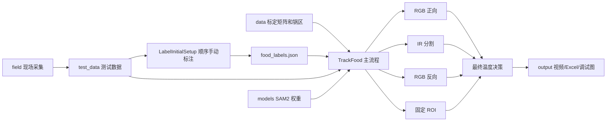
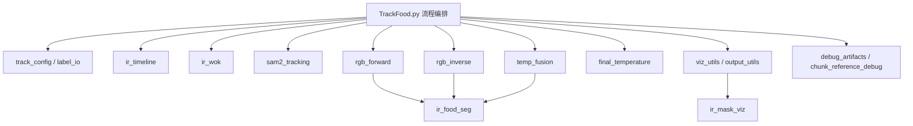
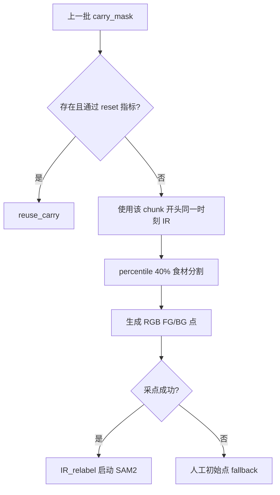
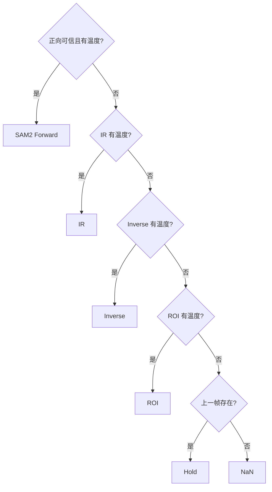

# Chef Vision 项目总说明

> 当前代码基线：`b85690d050897335cb5be21074febd44775299b3`  
> 文档审阅日期：2026-07-26  
> 当前主线：RGB 正向 + IR 辅助重采点 + RGB 反向辅助 + ROI 对照 + 最终温度决策

本文既是项目总览，也是所有目录说明的导航入口。它描述当前真实代码，不以
早期日志、归档版本或旧专利图为准。

## 1. 这个项目做什么

Chef Vision 用同步采集的 RGB 视频和红外温度矩阵，追踪炒锅中的食材并输出
逐帧温度。系统不是只依赖一种分割，而是并行形成四路候选温度：

1. RGB 正向：SAM2 直接追踪食材。
2. IR：在红外锅区内分割低温食材区域。
3. RGB 反向：SAM2 追踪锅底，再以 `锅区 - 锅底` 估计食材区域。
4. ROI：固定圆形区域的传统温度基准。

随后由独立模块输出唯一的最终温度：

```text
可信 RGB 正向 -> IR -> RGB 反向 -> ROI -> 保持上一帧 -> 无结果
```

## 2. 项目全景



主程序与算法模块的关系：



## 3. 一次完整运行的阶段

### 阶段 A：准备输入

需要的最小输入是：

- RGB 视频；
- 对应的 `temp_*.npy` 红外温度矩阵；
- `core/food_labels.json`；
- `data/homography.npy`；
- `data/wok_region.json`；
- SAM2 权重。

若 RGB/IR 时间戳文件都存在，系统会按时间戳对齐；否则按总帧数比例估算。

### 阶段 B：读取标注和配置

`track_config.py` 解析命令行，`label_io.py` 读取：

- 食材初始 FG/BG 点；
- 锅底初始 FG/BG 点；
- 视频路径；
- 可选 RGB 锅区信息。

当前 test8_1 的食材和锅底初始标注都位于第 60 帧，即 2.4 秒。这里不是固定
写死的帧号，而是当前 `food_labels.json` 的选择。

### 阶段 C：加载 IR 与锅区

`ir_timeline.py` 加载温度矩阵并建立 RGB -> IR 帧映射。

`ir_wok.py` 读取 IR 椭圆锅区，根据运行策略尝试更新位置，再投影为 RGB 锅区
约束。当前默认策略是 `legacy`；也可选择 `static` 或 `frame_shift`。

### 阶段 D：加载 SAM2

`sam2_tracking.py` 加载：

```text
models/sam2.1_hiera_large.pt
configs/sam2.1/sam2.1_hiera_l.yaml
```

当前为纯 SAM2 模式，光流关闭。每 100 帧作为一个 chunk，25 fps 时约 4 秒。

### 阶段 E：RGB 正向

每个 chunk 开头先检查上一批末尾 `carry_mask`：



正向当前主要异常条件：

- mask 与锅区重叠低于 60%；
- mask 小于锅区 5%；
- mask 大于锅区 60%；
- 相对可信参考骤降超过 70%；
- 轴心区域占比达到 60% 且质心靠近轴心，连续 15 帧；
- mask 的 40% 以上位于锅区上半部，连续 25 帧，且总面积在 5% - 25%。

批内逐帧判坏只记录事件，不立即无限重启；下一批开头再消费待处理事件。

### 阶段 F：RGB 反向

反向独立追踪锅底 `bottom_mask`：

```text
inverse_mask = RGB 锅区约束 - bottom_mask
```

反向 reset 判断对象是 `inverse_mask`，有效面积范围同样是锅区的 5% - 60%。
异常时记录 pending reset，下一批开头重新检查；无法复用时尝试 IR 生成锅底
提示点，仍失败才回到人工初始锅底点。

正向和反向在每个 chunk 内先后运行，不是并发，也不是正向整段跑完后才跑
反向。

### 阶段 G：四路温度统计

| 路径 | 区域来源 | 温度位置 |
|---|---|---|
| SAM2 正向 | RGB 食材 mask | 投影到当前 IR 帧 |
| IR | IR 锅内 percentile 40% 食材 mask | 直接在当前 IR 帧 |
| Inverse | RGB `锅区 - bottom_mask` | 投影到当前 IR 帧 |
| ROI | 固定 RGB 圆形 ROI | 投影到当前 IR 帧 |

RGB 正向/反向的 SAM2 负责“找区域”，真实温度始终来自红外温度矩阵。

### 阶段 H：最终温度

`final_temperature.py` 只负责选择，不重新计算 mask：



结果同时记录温度、`source` 和 `reason`。

### 阶段 I：输出

`output_utils.py` 生成：

- 三栏合并视频；
- 四路候选温度曲线与单独最终温度曲线；
- 四路候选温度 Excel 与最终温度 Excel；
- H.264 转码（系统有 ffmpeg 时）。

调试模块保存异常事件、IR 重采点参考和逐 chunk 启动参考。

## 4. 当前关键开关

| 开关/参数 | 当前值 | 状态 |
|---|---:|---|
| `IR_FOOD_SEG_MODE` | `percentile` | 开启 |
| `IR_FOOD_SEG_PERCENTILE` | 40 | 开启 |
| `IR_PANEL_SEG_MODE` | 跟随主分割 | 开启 |
| `CHUNK_SIZE` | 100 | 开启 |
| `RELABEL_INTERVAL_S` | 4 | 开启 |
| `FORWARD_UPPER_WOK_ENABLE` | `True` | 开启 |
| `ENABLE_UPRIGHT_WOK_FREEZE` | `False` | 关闭 |
| `OPTICAL_FLOW_INTERVAL` | 0 | 光流关闭 |
| RGB 正向批内 IR-fix | `if False` | 保留但关闭 |
| RGB 反向批内 IR 覆盖 | `if False` | 保留但关闭 |
| 严格 IR-IoU 门控 | `if False` | 保留但关闭 |
| 在线 pipeline | `False` | 仅接口壳 |

## 5. test8_1 实际流程示例

输入：

```text
test_data/test8_1/rgb_20260707_153017.mp4
test_data/test8_1/temp_20260707_153017.npy
test_data/test8_1/rgb_20260707_153017_ts.npy
test_data/test8_1/temp_20260707_153017_ts.npy
```

标注起点：第 60 帧，2.4 秒。

参考完整结果：`output/20260724_115656/`。

该次结果：

- 处理 3177 帧；
- 约 32 个正向 chunk；
- 约 32 个反向 chunk；
- 3 次正向 IR_relabel；
- 13 张异常事件图；
- 四路候选温度 Excel 与最终温度 Excel 均为逐帧结果；
- 最终合并视频约 494 MB。

这份结果适合用来理解当前输出，但优化前后对比时必须保持相同输入、标注和
处理范围。

## 6. 如何运行

### 首次或更换测试视频

```powershell
python core/LabelInitialSetup.py
```

若更换测试数据，可按目录自动匹配 RGB 视频和 IR 温度矩阵：

```powershell
python core/LabelInitialSetup.py --data-dir test_data/test8_1
```

该入口会依次打开 RGB 正向食材标注、RGB 反向锅底标注、IR 锅区/旋转轴圆心/排除圆标注。

### 120 帧短测

```powershell
python core/TrackFood.py --max-frames 120
```

### 完整测试

```powershell
python core/TrackFood.py
```

### 显式指定全部关键输入

```powershell
python core/TrackFood.py `
  --labels core/food_labels.json `
  --video test_data/test8_1/rgb_20260707_153017.mp4 `
  --temp test_data/test8_1/temp_20260707_153017.npy `
  --homography data/homography.npy `
  --wok data/wok_region.json `
  --ir-wok-strategy legacy `
  --output-root output
```

## 7. 输出结果快速阅读

```text
track_result_combined.mp4
  左：RGB 正向绿色 mask
  中：RGB 反向紫色 inverse mask
  右：IR 热图、锅区、食材边界和轴心圈
  下：四路候选曲线 + 最终温度曲线
```

需要排查某一时刻时：

```text
异常原因          -> violation_events/
下一批最终动作    -> relabel_previews/
IR 采点原始依据   -> ir_relabel_frames/
每批启动参考      -> forward_chunk_references/ / inverse_chunk_references/
最终温度来源      -> temp_final.xlsx
```

完整解释见 [output/README.md](output/README.md)。

## 8. 顶层目录导航

### 当前运行与数据

| 目录 | 说明文档 | 定位 |
|---|---|---|
| `core/` | [core/README.md](core/README.md) | 当前离线主流程和算法模块 |
| `data/` | [data/README.txt](data/README.txt) | 标定矩阵和锅区配置 |
| `field/` | [field/README.txt](field/README.txt) | 现场采集和轻量温度监测 |
| `sdk/` | [sdk/README.txt](sdk/README.txt) | 热像仪 SDK 和 DLL |
| `tools/` | [tools/README.txt](tools/README.txt) | 标定、锅区检测、同步剪辑 |
| `models/` | [models/README.md](models/README.md) | SAM2 权重 |
| `output/` | [output/README.md](output/README.md) | 运行结果和阅读方法 |
| `test_data/` | [test_data/README.md](test_data/README.md) | RGB/IR/温度测试集 |
| `排查工具/` | [排查工具/README.md](排查工具/README.md) | 一次性分析与验证脚本 |

### 归档与候选

| 目录 | 说明文档 | 定位 |
|---|---|---|
| `旧代码库/` | [旧代码库/README.md](旧代码库/README.md) | 早期代码备份，不被主线调用 |
| `旧日志/` | [旧日志/归档说明.md](旧日志/归档说明.md) | 过期阶段记录 |
| `专利相关材料/` | [专利相关材料/README.md](专利相关材料/README.md) | 技术交底、附图和生成材料 |
| `食材状态识别/` | [食材状态识别/README.md](食材状态识别/README.md) | 生/熟/焦糊分类实验 |
| `可能不需要的文件/` | [可能不需要的文件/README.md](可能不需要的文件/README.md) | 尚未最终删除的候选 |

> 版本管理注意：`output/` 和 `test_data/` 当前被 `.gitignore` 整体排除，
> 因此这两个目录的 README 已保存在本机，但不会自动进入 Git commit。

## 9. 依赖与环境

根 `requirements.txt` 用于安装可通过 pip 直接安装的常规 Python 依赖：

```text
numpy
opencv-python
matplotlib
torch
openpyxl
```

完整主流程还需要：

- `sam2`，需要按本机 CUDA/PyTorch 环境单独安装并确认可导入；
- ffmpeg 可选；
- NVIDIA CUDA 环境推荐。

现场采集主要需要 `numpy`、`opencv-python`、`matplotlib` 和同目录 DLL。

## 10. 当前边界

- 主线是离线 chunk 处理，不是已经完成的实时系统。
- 在线接口只是关闭的外壳。
- 锅区动态更新和旋转轴跟随已经存在，但定位精度仍是后续重点。
- percentile 40% 在当前测试中比 two-cluster 更稳定，但不是所有菜品的
  永久最优结论。
- 食材状态识别是独立归档实验，没有接入温度主线。
- 归档目录不被当前主程序调用。

后续算法选择见 [后续优化方向.md](后续优化方向.md) 和
[待办事项优先推荐.md](待办事项优先推荐.md)。
